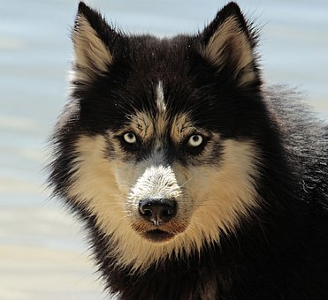

# ResNet-50 Model Deployed to API Endpoint  
This repo contains everything needed to deploy a pre-trained ResNet-50 CNN as an API endpoint utilizing [Flask](https://flask.palletsprojects.com/en/1.1.x/), [Gunicorn](https://gunicorn.org/), [NGINX](https://www.nginx.com/), and [Docker](https://www.docker.com/).  

## ResNet-50
ResNet-50 refers to a 50 layer residual neural network that is commonly used to classify images. ResNet-50 was trained on more than one million images from the ImageNet database and can classify images into 1000 object categories. The use of a wide array of images resulted in rich feature representations that can be applied broadly.  

## Deploy the API  
The API can be deployed locally using `docker-compose`. The following commands will launch the flask API on your localhost.  

```bash  
docker-compose build  
docker-compose up
```  

## Send Requests  
Once you've deployed the model (it takes a few seconds for the ResNet-50 model to load), you can send image requests to it with the following command:  

```bash  
curl -X POST -F image=@imgs/husky.jpg "https://localhost:5000"
```  

The command sends the following image to the API:  


You should receive a JSON response object with predictions for the image.  

```json  
{
  "predictions": [
    {
      "label": "Eskimo_dog",
      "probability": 0.5135327577590942
    },
    {
      "label": "Siberian_husky",
      "probability": 0.35967519879341125
    },
    {
      "label": "malamute",
      "probability": 0.10648568719625473
    },
    {
      "label": "collie",
      "probability": 0.004213731735944748
    },
    {
      "label": "timber_wolf",
      "probability": 0.003469904651865363
    }
  ],
  "success": true
}  
```
